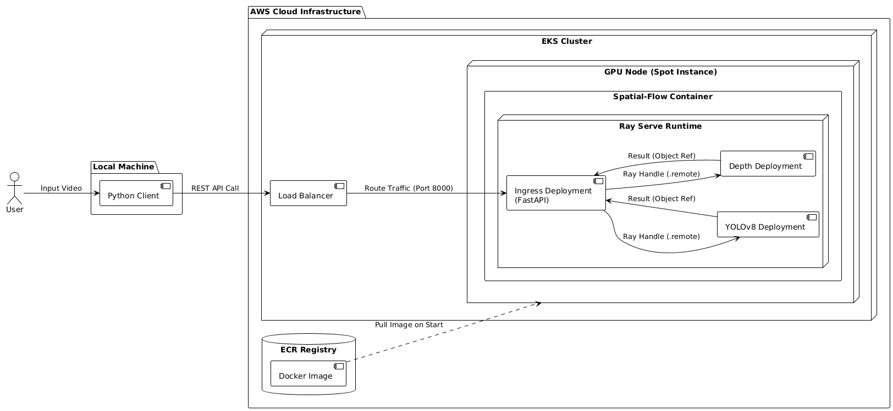

# Spatial-Flow: High-Throughput MLOps Pipeline
### Orchestrating Real-Time, Asynchronous Multi-Model Inference


## Overview
**Spatial-Flow** is a high-performance, distributed MLOps pipeline designed for real-time spatial perception. It orchestrates parallel, asynchronous inference of **YOLOv8** (Object Detection) and **Depth Anything** (Monocular Depth Estimation) on continuous video streams. The architecture is fully containerized with **Docker** and managed by **Ray Serve**, deployed on **AWS EKS** (Elastic Kubernetes Service) for scalable execution.

## System Architecture



**Spatial-Flow** implements a **Scatter-Gather** microservices pattern using **Ray Serve**:
*   **Parallel Inference:** Asynchronous dispatch of video frames to decoupled **YOLOv8** (Detection) and **Depth Anything** (Depth) actors.
*   **Zero-Copy Efficiency:** Uses Ray Plasma shared memory for high-performance intra-cluster data transfer.
*   **Scalable Infra:** Fully Dockerized, GPU-accelerated workers managed via AWS EKS and Kubernetes manifests.

## Tech Stack
- **Orchestration:** [Ray Serve](https://docs.ray.io/en/latest/serve/index.html) (Distributed Python)
- **Containerization:** Docker + Nvidia Runtime
- **Infrastructure:** AWS EKS & ECR, Kubernetes
- **Models:** 
  - `Ultralytics YOLOv8` (Objection Detection)
  - `LiheYoung/Depth-Anything` (Depth Estimation)
- **API:** FastAPI (REST, Asynchronous Ingress)

## 🚀 Deployment

### Option A: Local (Docker)
The easiest way to verify the pipeline.

```bash
# 1. Build the image
docker build -t spatial-flow:gpu .

# 2. Run with GPU support and Dashboard
docker run -d --rm --gpus all \
    -p 8000:8000 \
    -p 8265:8265 \
    --name spatial-flow \
    spatial-flow:gpu
```

### Option B: AWS EKS (Production)

```bash
# 1. Create Cluster
eksctl create cluster -f eks_cluster_config.yaml

# 2. Deploy Manifests
kubectl apply -f kubernetes_deploy.yaml
```

## Running the Client
The Python client streams video to the inference engine and visualizes the fused output (Detection + Depth Heatmap).

```bash
# Localhost
python client/test_client.py --source data/market.mp4

# Remote AWS Load Balancer
python client/test_client.py \
    --source data/market.mp4 \
    --url http://<EXTERNAL-IP>/predict
```

## Monitoring
Access the **Ray Dashboard** at `http://localhost:8265` to monitor actor status, GPU utilization, and request latency.

---
*Created by [Rahul K]*
